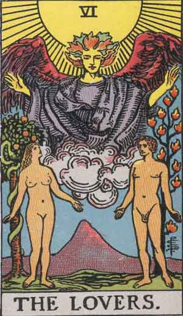

# Voting

 

## **Loosely Coupled**

Loosely Coupled Votes happen off-chain and act as signal of a change that should be implemented. The community then decides to honour this vote and update the soft protocol accordingly.

##  **Tightly Coupled**

Tightly Coupled votes happen on-chain. Whatever the majority decides through the vote is automatically adopted, as the vote is part of the hard protocol.

