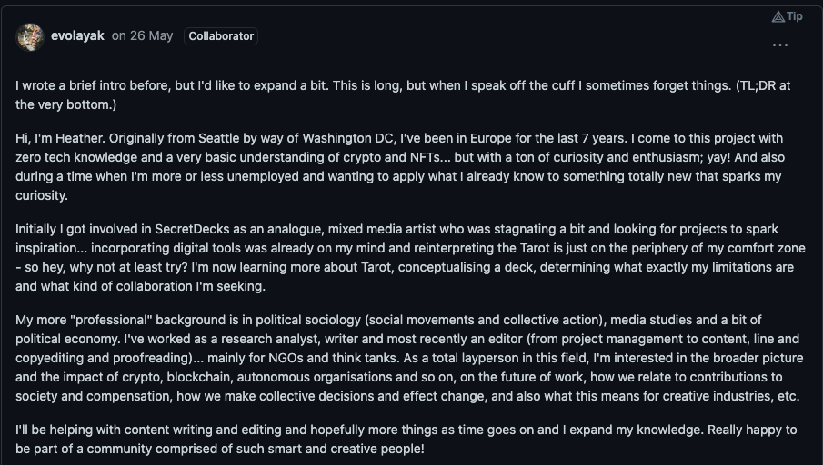
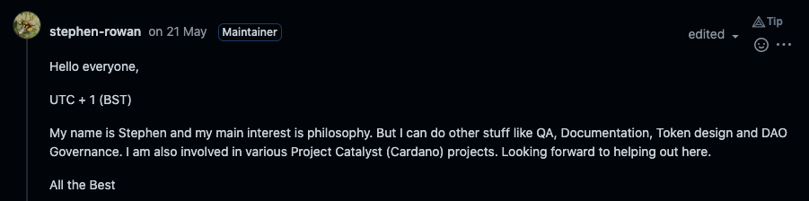
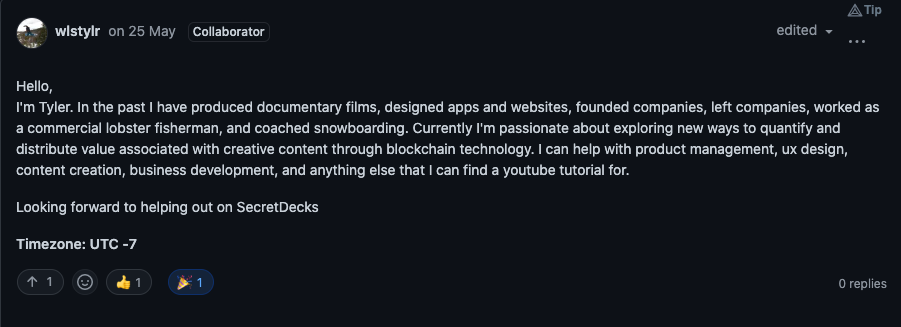
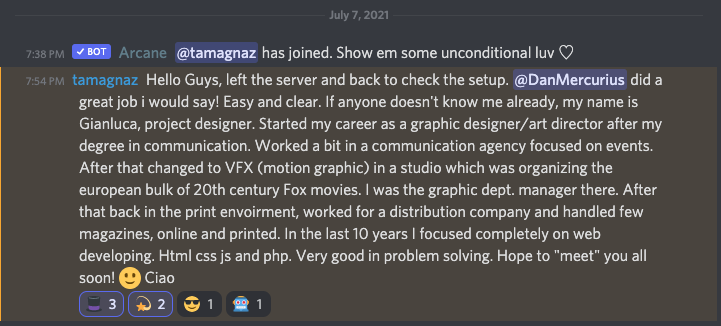
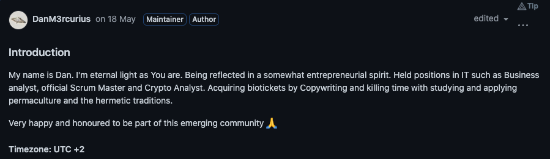
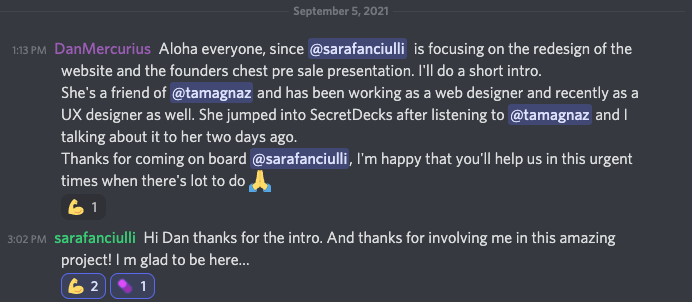

# The DisCo

## We're not a company or a team. We are a distributed cooperative, DisCo for short.

## Core 

### Heather

_Editing, artist outreach, community care work_

### Stephen

_aka REPO-MAN; Quality assurance, system automation, documentation, token design;_ 

### Tyler

_UX, product management, CoopDev \(previously BizDev\)_

### GianLuca

_Web development, DevOps, art direction_

### Dan 

_Secretary, copywriting, product management, other stuff_

## Artists & Designers

### Elisa \(logo creator!\)

[Portfolio](https://issuu.com/elisadecrescenzo/docs/portfolioelisadecrescenzo2_798a666232b54b).

### Sara

_UX, web design, brand design_

## Tarot Artists

To be revealed soon

