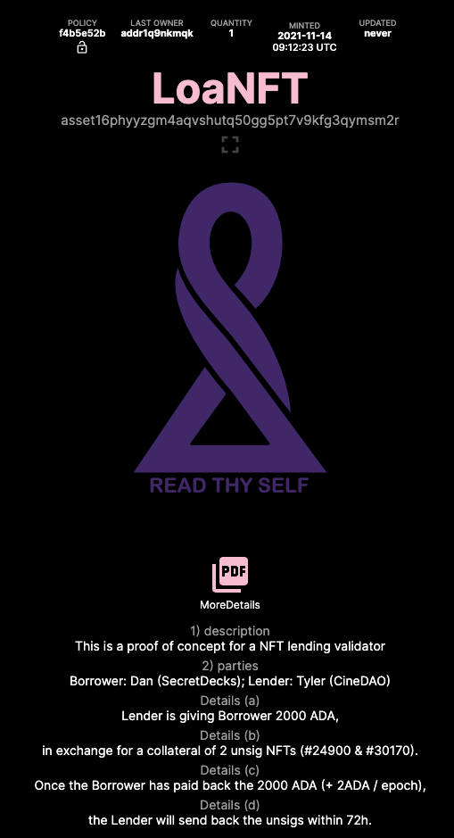

# The Stake Pool

## SecretDecks is running a Cardano Stake Pool! Ticker name: <mark style="color:purple;">TAROT</mark>.

#### <mark style="color:purple;">Every wallet staking with TAROT will be whitelisted for the first 3 Tarot SUMMONS (NFT drops).</mark>

### What the pledge?

For the pledge of **2500 ADA** two of the DisCo members created a **loan agreement as a NFT** (called LoaNFT) - a rough proof of concept. The borrower asked for 2000 ADA and offered two [_unsigned algorithm_](https://www.unsigs.com)_ (unsig)_ NFTs as collateral. Since both lender and borrower know each other well it was possible to facilitate this without a validator (smart contract).&#x20;

#### LoaNFT flow

The borrower sent the _unsig_ NFTs to the lender wallet, the lender sent the 2000 ADA to the pools pledge wallet. The NFT was created (with both above mentioned transaction IDs) and sent to the pools reward wallet. The remaining 500 ADA was lent to the pool by the borrower.

Once the pool reward wallet is vital enough to sustain a 2000 ADA withdrawal the ADA will be sent to the lender. The borrower receives the _unsig_ NFTs from the lender and the NFTLoan is burned.

### Pool details

SPOCRA is aiding SecretDecks by maintaining the hardware and backend as well as guiding us through the key generation process. Especially Lauris (EU01 pool) is extremely helpful and knowledgable!

**The pools mission**

Elevating Tarot into hyperspace and creating tools for all to Read Thy Self.

**Pool margin: 4%**

****
