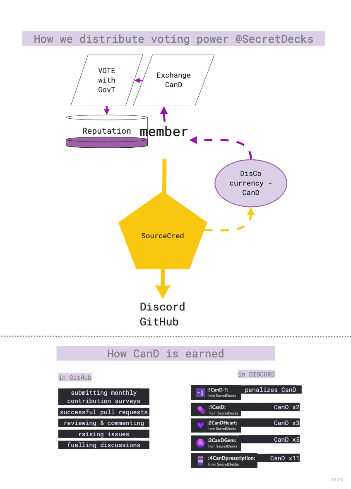
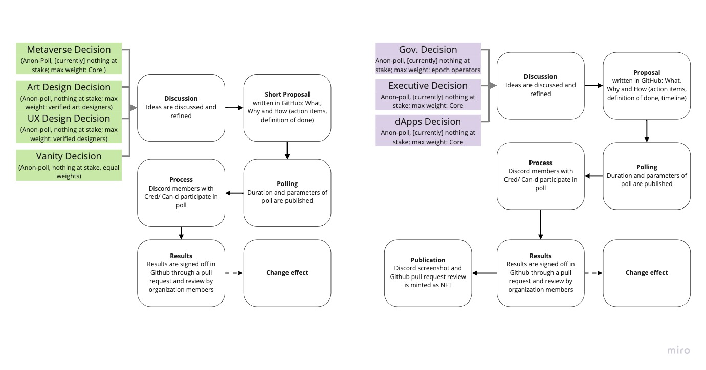

# Who & What is SecretDecks?!

### Who is SecretDecks?

SecretDecks is a colourful collective of mindful spirits who work towards leaving this dimension a better place. Discovering and exploring new tools for self organising communities is our common motivation. All members share an agreed upon values, defined in the [Mindfulness Policy](https://github.com/SecretDecks/Documentation/blob/main/Mindfulness-Policy.md), which sets the base vibration of our work. 

### What is SecretDecks?

Our goal is to create a Tarot metaverse on web 3.0 architecture within a distributed cooperative \([DisCo](https://disco.coop/manifesto/)\) and freely share the tools we discover and create to help other cooperatives grow and prosper. SecretDecks' first artist collaboration is with two amazing Italian artists, introducing their original Tarot decks to the realm of virtual collectibles. 

SecretDecks is the soul of the distributed cooperative \(DisCo\) currently being built. Like a brand is to a company, SecretDecks generates value external to the inherent value of the entity and can thus help to sustain and nourish it in a transcendental way.

### How we do stuff.

Anyone from lurker to NFT collector, artist or builder - \(seriously, just about anyone\) can go through the onboarding process. Approved members are rewarded after tasks are done and their contribution is validated by peers. Additionally we use SourceCred to track intangible contributions and reward community care work by distributing a social currency we call Can-D. This currency can be earned by actively engaging in Discord and GitHub. It soon will allow for more voting power and after a certain threshold makes eligible for ADA rewards.

Successively, each member is attributed \(voting\) power on a merit basis. A basic polling system is in place and will soon be extended with a blockchain recorded voting process. Distributed decision making tools and processes will be piloted and iterated until comprehensive parts can be published under OpenSource licenses.

### Metaverse dApps!

The seeds of the Tarot metaverse will be planted within the applications listed below, developed by the cooperative. Each milestone the dApps will transform into something greater than before. For example, READINGS will employ a simple chat text interaction in its first iteration, however will eventually move into virtual reality, allowing readers to welcome their clients in a place they can design themselves and engage on a direct and personal level. 

* SD-"DROPS" - NFT launchpad \(for virtual Tarot card collectibles\) on Cardano
* SD-"READINGS" - p2p Tarot reading; to help with reading the Book of Thoth  
* SD-"SOULJOURNAL" - personal meta-journal to help you connect with your inner Self
* SD-"SHARE" - p2p collectible trade, to help complete collections
* SD-"STAKING" - stake your NFT to receive rewards from SD-SPO

In order to fast-track development, offer remuneration to the handful of people who have been working on this the past 6 months, and to test the distributed contribution reward mechanism, SecretDecks decided to do a **Founders Drop** **on Cardano with a limited supply of 333 pieces** with three different rarity tiers**.** The drop will happen ****in October, for the exact date follow us on [Twitter! ](https://twitter.com/SecretDecks)or join our [Discord](https://discord.gg/V4UXUuXNYW)!

#### For more information on the Founders Drop [tap here](the-founders-drop.md).

