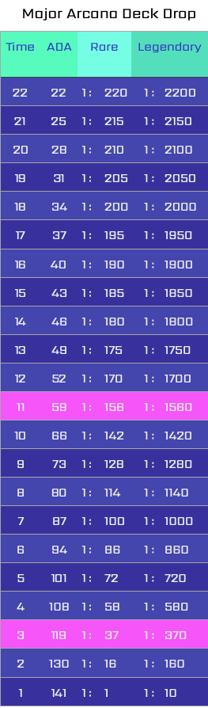

# SecretDecks: DROPS

### Summary

DROPS is a NFT launchpad for virtual Tarot card collectibles.   
The first two decks will feature original hand drawn content from two Italian artists who created two decks decades ago. They are now being immortalised in the metaverse and will have ornamental animations. 

Future drops will see multiple established and emerging artists collaborate on decks, each with their own unique interpretations.

The more rare the NFT the more animation you can expect!

### Details 


Each deck is only minted during a drop and **never** again! However, the common NFTs are unlimited in terms of how many times they can be minted during a drop; the rare and legendary ones are limited. There will be burn events where collectors can burn \(7\) of the same common cards to acquire a rare version of that card or \(13\) of the same common card to receive a legendary version. A full deck \(Major & Minor Arcana\) consists of 78 cards. Each full deck drop is made up of 78 price levels, with a simultaneous decreasing time limit and increasing rarity for each pull at each level. 

### Minting amounts

Common cards can be minted an unlimited number of times for as long as the drop is live. Rare and Legendary cards will be limited.

IF ALL LEGENDARY AND RARE CARDS ARE MINTED, the drop level stays the same or we close the drop and let collectors buy on the secondary market.

### Drop simulation

For a full deck: during the first 78 minutes a pull will cost 22 ADA and there's a 1:78 chance to get a rare and a 1:780 chance to get a legendary. For the next 77 minutes, a pull will cost 23 ADA and there's a 1:77 chance to get a rare and a 1:770 chance to get a legendary. This goes on until the 57th level when the time limit is 22 minutes - the price jumps up to 99 ADA per pull, with a 1:22 chance for a rare and 1:220 chance for a legendary. At the final level there's a time limit of 1 minute and a cost of 160 ADA, with a 1:1 chance for a rare and 1:10 chance for a legendary.

