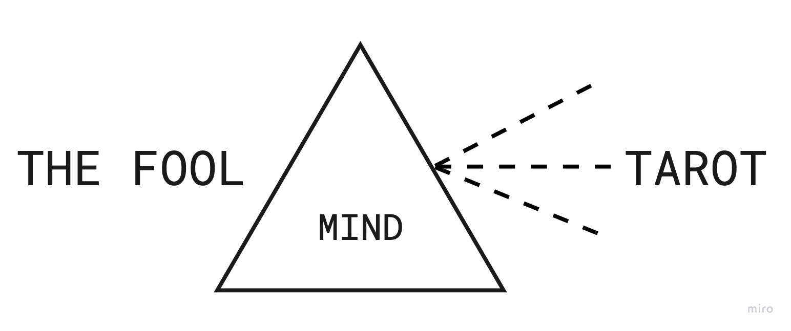

# Book of Thoth: Page 0

## The Fool (0)

### Intro & Etymology

beginning or end? Alpha & Omega? 1st or 22nd page of the major arcana?

For some it sits between XX and XXI, this stems from too much focus on the term "fool" itself, from its historical & psychological or archetypal meaning;

The actual image falls short or is "pre-loaded" with meaning imbued from the above focus on the term.

Some Tarot scholars point out that names were added later to the major arcana, while first there were only number

0 only number from Arabic system, all others are Roman; is then 0 here not only a number but the symbol of a circle or the ellipse?&#x20;

Remember "[Tarot in Cyphers](tarot-in-cyphers.md)" showed that Rota (wheel) also means Tarot; maybe how the Tarot is "laid out" or constructed (in a circular spiral like pattern), then THE FOOL can be both beginning and end at the same time or neither! In that sense THE FOOL is more a portal or a transition from XXI to I.

To have 0 at the beginning means stillstand of Rota at the point of beginning, however nowhere in the Book of Thoth is it said cosmic creation will stand still.

### Symbols & imagery (Smith-Waite Deck)

* human in dancing stance
* in mountains, close to edge
* ornamented garments
* black staff over shoulder&#x20;
* satchel end of staff
* white rose in left hand
* white dog (playing?) at feet
* white sun shining
* red feather in blonde hair
* green cap or diadem

### Symbols & imagery analysis

* Dancing stance:
  * resembling androgyn in XXI, but comparison reveals:
    * Androgyn: harmony; mastering of material form
    * Fool: uncoordinated  / random; not adhering to any order or an idea / unbound anarchistic&#x20;
* White sun:
  * white: whole spectrum of color -> pure potential **before** taking form / order and parts form own individual existence like colors broken in a prism
  * other white elements on the page: mountain tops, dog, underwear, rose
  * Sun on other pages: VI, XIII, XIV, XIX
  * Rose on other pages: I, V, XI, XIII, XVIII
  * Mountain on other pages: IX, XX
* Satchel: many myths around content of satchel (Pulp Fiction'esque)
  * old traditions say he's carrying the four magical tools within (hiding them)

A being in between past and future, knowing past is out of influence & future is unknown, albeit being fashioned from basic elements s\*he's carrying & embodying.&#x20;

### Hypothesis: Fool = Seed of Major Arcana

Are fragments of all 21 other cards contained within the 0?

* Staff of hermit and red feather of death / sun-child point in that direction
* Neckline of underwear looking like garment of Michael in XIV
* Grenade apples from High Priestess (II)

Go deeper and look for your Self, there's almost nothing not existing as potential  or possibility in this image. Maybe even all 78 cards are hidden within? The primordial fractal image out of which all others shine, like colours from white light broken in a prism.

### Heroes Journey Position

#### Previous page: The World (XXI)

XXI shows cosmos in utter order & harmony, filled with life; the true being of the universe is life and being alive, which shows in impermanence

* How can complete harmony change? Either stop (death) **or** transformation through dissolvement;
* complete harmony (order) can only change if moving towards opposite (chaos)&#x20;

\-> only way for Fool is over the edge -> Symbolism of the waterfall (from III as figure for birth/creation)

* Jump/fall over cliff into chaos = brith! into what? -> carrying from one plane to the next

#### Next page: The Magician (I)&#x20;

* What will Fool do next? Maybe once arrived on the other plane, finds a table to lay out tools; thus the wheel of life turns and he becomes a **Magician**
* In some interpretations there are two ways for the Fool to take:
  * at the bottom of the cliff is a crocodile waiting for him (representative of the reptile, the lower primitive form of life);&#x20;
    * Fool has to take tools and combine with knowledge of Self (through reading the Book of Thoth) to ascend a level higher, and become anew The **Magician** (another turn up the spiral)
    * OR
    * swallowed by crocodile, loosing what was gained before and commence anew from a lower level
  * **Magician** and reptile are both forms of life in cosmos, both are life, You have the choice which one You want.
  * XXI shows the world egg, all energy & matter condensed within & exploded upon reaching critical mass; forming the universe
    * Once max circumference of universe overstepped, it'll revert back to world egg
    * \[The Fool is the transition in and out of this world egg]

### Order & Chaos & Tantra

* 0 as unit of chaos, containing everything in disorder;
* Myths of natives tell about creation out of chaos, where all building blocks, needed to conjure all of cosmic creations, are available;
* Chaos just _is,_ the chaos Fool jumps in is pure **istness**&#x20;
*   In eastern teachings TANTRA (net, loom) \[everything is connected in cosmos even in chaos]

    &#x20;\= "istness"

### Archetype

The child

### Keywords

in awe, openness, new begin

#### Sources

[_"Schule des Tarot - Band 1" - Hans Dieter Leuenberger_](https://www.goodreads.com/book/show/17166596-schule-des-tarot-band-1) _(p. 291 ff.)_

